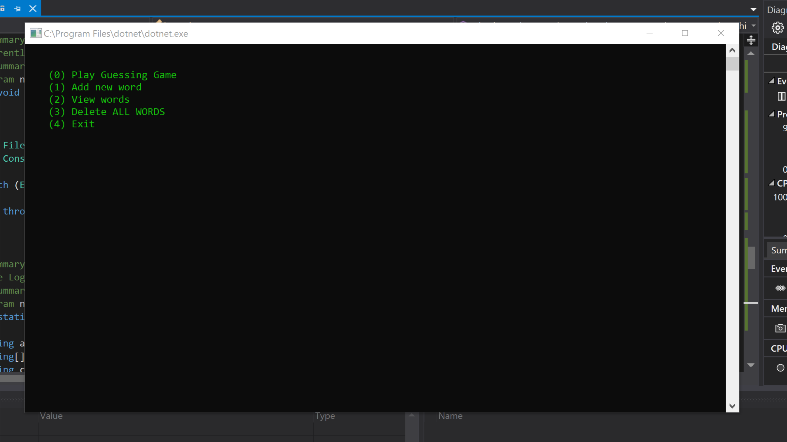
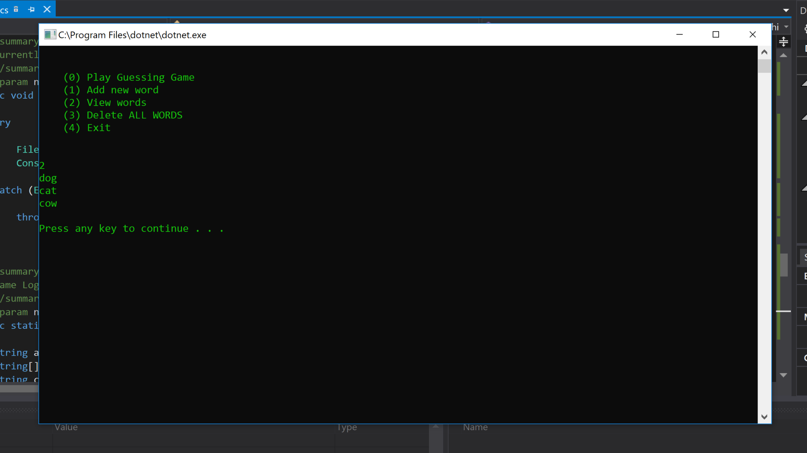
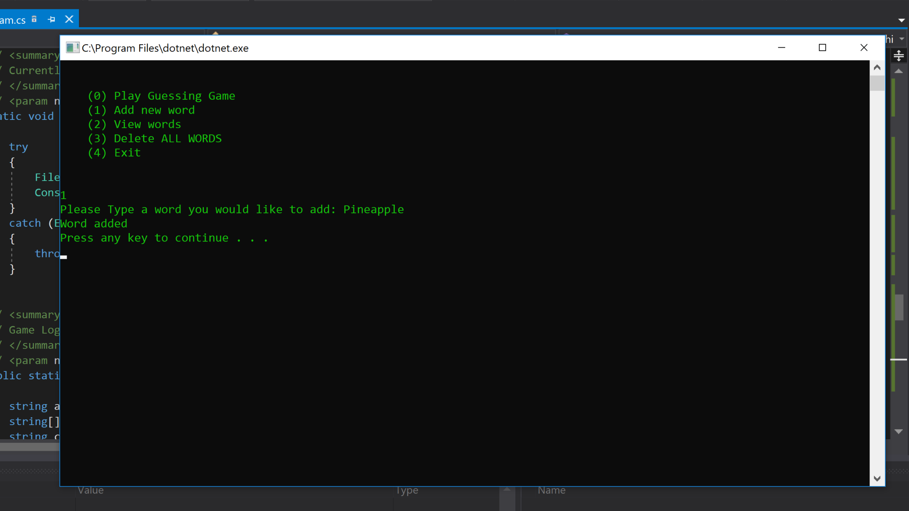
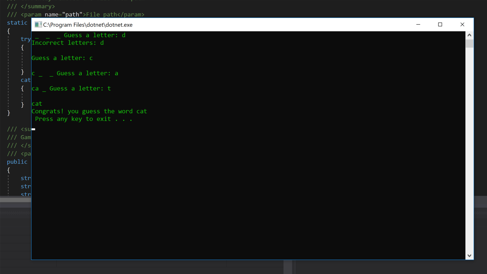

# Lab03-SystemIO

Guessing game that allows you to add words, removed words, and allows you try to guess words in a text file

## Instalation 
To run you need Visual Studio 2017, navigate to "" open with Visual Studio 2017 then press Ctrl+F5 to compile and run, or click the green arrow on the top toolbar.
## Screenshots

### main

### View words

### Add words

### Win

